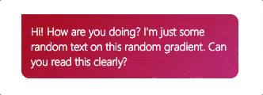

# adaptive-gradient [](https://badge.fury.io/js/adaptive-gradient)
A super simple JS library that suggests you a background gradient with font-color shading suggestion.



Installation:
```
npm install -S adaptive-gradient
```

Javascript:
```js
var gradient = require('adaptive-gradient');
console.log(gradient('#ba1c1c'));
```

Output:
```js
{
  start: 'BA1C1C',
  end: 'C7437A',
  fontShouldBeLight: true
}
```
